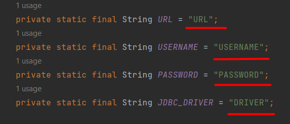

# 
**GoCab app** :oncoming_taxi:

##  :speech_balloon: Description
`This is a simple web application with the ability to authorize, register, and perform other CRUD operations.
This taxi service has users (drivers) who have cars. In addition, you can create cars with their manufacturers.
You can also manage who owns a particular car by adding and removing car drivers.`
## :clipboard: Features
- registration new driver like user
- user authentication
- logout
- create/update/delete driver
- create/update/delete manufacturer
- create/update/delete car
- displaying all drivers/manufacturers/cars
- assignment/deleting a driver to a car

## :bricks: Project structure
The web-application has 3-tier architecture:
- DAO
- Service
- Controller

There are also relations between the tables. The complete database structure is shown below.

## :globe_with_meridians: Used technologies
- Java 11
- Maven
- JDBC
- MySQL
- Servlet API
- JSP/JSTL
- HTML
- Log4j2

## :zap: Setting up
1. First of all, you need to prepare the database. (For developing this web application, MySQL was used.) Create a schema and copy everything from the `resources/init_db.sql` file, then execute it in your DBMS.
2. To set up the project input correct credentials. In the class ConnectionUtil, substitute the highlighted variables.
   
3. After that, you need to configure Tomcat **(Use only Tomcat 9)**. To do this, you have to choose `war exploded` and leave only `/` in the application context.
   
4. When you launch application you have to add new driver for further action. So, redirect to url `/drivers/add` and then go to `/login`.
## :globe_with_meridians: *Deployment*
- The project is deployed on AWS Elastic Beanstalk. You can access the deployed project through the following URL: [Taxi Service Deployment](http://taxiservie-env.eba-32dqmjkk.eu-north-1.elasticbeanstalk.com/login)

